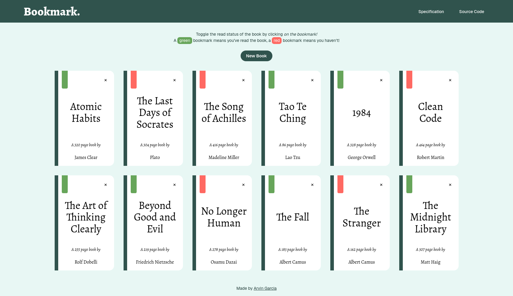

<h1 align="center">
  Bookmark
  <h4 align="center">Store all of your favorite books in one place with Bookmark.</h4>
</h1>

## 🚀 Live Site

The live site can be viewed [here](https://library-lovat-seven.vercel.app/).

## 📝 Project Description

For this project, the task is to create a web application where users can add and remove books. The [project specification](https://www.theodinproject.com/lessons/node-path-javascript-library) goes over some of the features and how it should be implemented, but generally, there is a lot of freedom on how the project can be approached. Objects and object constructors were taught prior, so that was the main concept to be picked up from doing this task.

## 💡 Learnings

Doing this project was fun! While [objects and object constructors](https://www.theodinproject.com/lessons/node-path-javascript-objects-and-object-constructors) were the primary concepts taught previously, I personally view this project more as a refresher on the JavaScript fundamentals taught in the [Foundations](https://www.theodinproject.com/paths/foundations/courses/foundations) course. Of course, the fundamentals were used a lot here, and so using those fundamentals in conjunction with objects and object constructors was a great learning experience.

On the topic of objects and object constructors, I only had one constructor function for creating a `Book` (as mentioned in the specification). Also, the `Book` constructor's prototype had a simple method named `toggleReadStatus()` that simply changes the `isRead` value of the object that invoked the method.

Admittedly, I feel like I've practiced DOM manipulation more than objects and object constructors since creating the constructor function and adding a method to its prototype wasn't too complex. I hope to practice it more in future projects!
