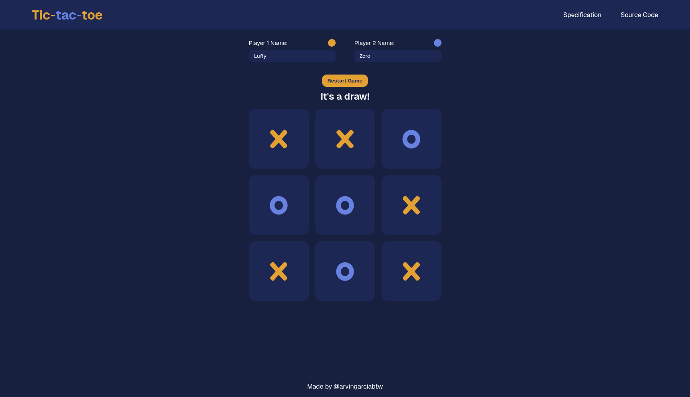

<h1 align="center">
  Tic-tac-toe
  <h4 align="center">Play the classic tic-tac-toe game in your browser.</h4>
</h1>

## 🚀 Live Site

The live site can be viewed [here](https://tic-tac-toe-black-one-53.vercel.app/).

## 📝 Project Description

The [project specification](https://www.theodinproject.com/lessons/node-path-javascript-tic-tac-toe) indicates the general instructions to be followed in doing this project. The project primarily revolves around practicing the use of factory functions and [IIFE](https://developer.mozilla.org/en-US/docs/Glossary/IIFE)s (module pattern). This [article](https://www.ayweb.dev/blog/building-a-house-from-the-inside-out) mentioned in the specification was greatly beneficial in getting the project going from the beginning.

## 💡 Learnings

This one was probably the most challenging project so far! While I've already finished the project (granted I decided not to implement a score feature), I'm still unsure of the approach that I took in doing the application. In fact, I did not use IIFEs. I plan to do more self-studying on that concept, to ensure that I really do understand when IIFEs are applicable (which from my current understanding, is when I only want one instance of that object). Perhaps I just find the module pattern to look a bit bizarre is all.

I am also unsure of naming conventions for factory functions. Taking a look at the article linked above, the factory functions are capitalized. But in examples from other resources, the factory function usually begins with an lowercase verb. So, I would need to look into that some more. Also, the term "controller" has been brought up in the specification (e.g. displayController). I've also seen this type of naming convention in other projects as well, but I'm not entirely sure when this would be appropriate to use. This is another thing I need to look into in my free time.

Also, it is in this project where the concept of destructuring really hit me. As mentioned, I used the article as a reference to structure my code from the start. In making their Connect Four console game, they used a 2d array for the board, and so I decided to do that for this project as well. But looking back, a 1d array would have been probably a lot easier for this project! But, using a 2d array allowed me to put array destructuring into practice.

Essentially, I have a `winConditions` array that has arrays. Each array represents a winning condition or combination. That array has three arrays inside, each representing the coordinate of a square or cell inside the board. What made it a bit tricky for me is that since it is a 2d array, I have to target a specific square through something like this: `board[row][column]`. For a 1d array, it would probably be something like `board[indexOfSquare]`, which is a lot easier.

Now, this is where destructuring helped. I looped through the `winConditions` array, and for each winning condition, I destructured those three arrays into three variables (`pos1`, `pos2`, `pos3`). Since each position contains both the row and column coordinate (e.g. [0, 0] means the square in the first row and first column), I can use those positions to extract the actual value of that square through something like this:

`const val1 = board[pos1[0]][pos1[1]]`

I probably spent too much time trying to figure out the logic for a player winning, but hey we got there eventually! 

Excited to fill in the gaps in what I currently know, and to move forward with the curriculum!
