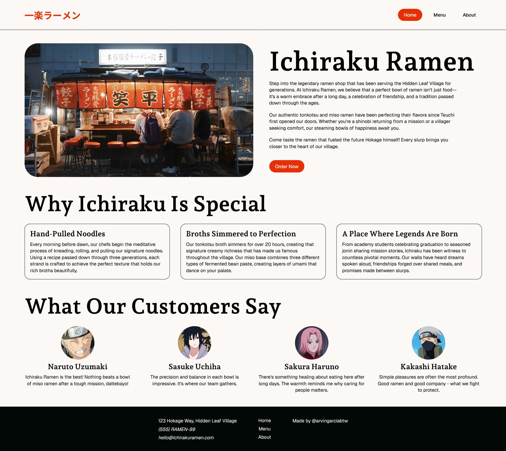
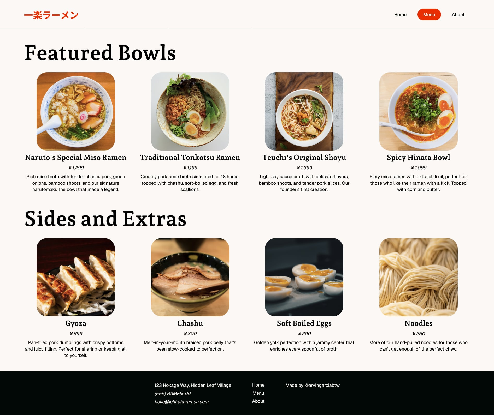
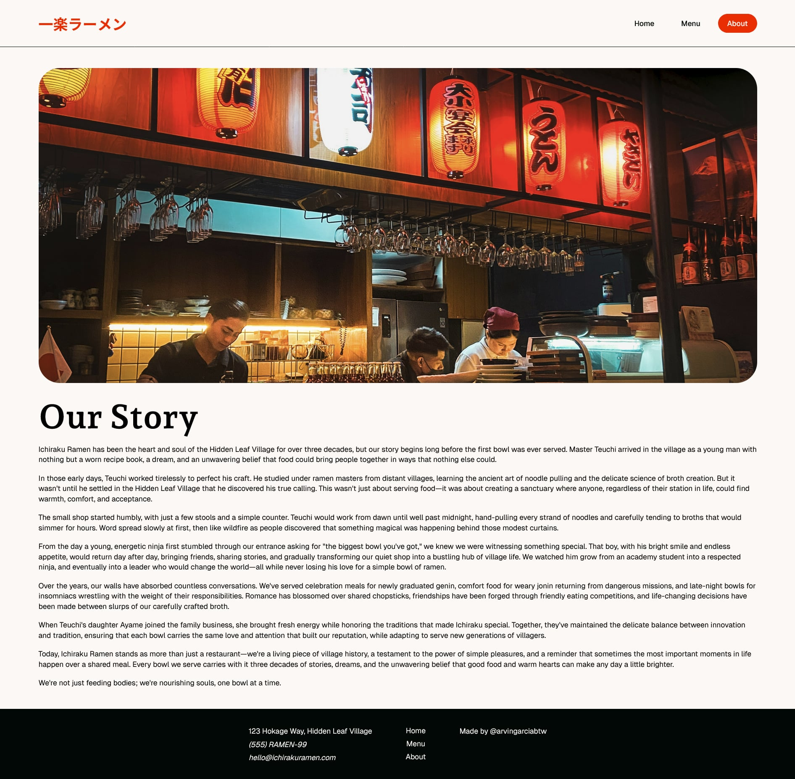

<h1 align="center">
  Ichiraku Ramen
  <h4 align="center">A website for the iconic Ichiraku Ramen restaurant from the anime Naruto!</h4>
</h1>

## 🚀 Live Site

The live site can be viewed [here](https://ichiraku-ramen.vercel.app/).

## 📝 Project Description

The [project specification](https://www.theodinproject.com/lessons/node-path-javascript-restaurant-page) describes the general instructions to be followed in accomplishing the project. All content in the main area of the webpage should be dynamically rendered with JavaScript. The project is also set up with [Webpack](https://webpack.js.org/). Furthermore, this project is a good opportunity to familiarize with ES6 modules. While not mentioned in the specification, I decided to implement classes as well since it is a concept taught prior this task.

## 💡 Learnings

Learned a lot with this one! The concepts taught before this (Webpack configuration, ES6 modules, classes) were all applied.

Configuring the project with Webpack was simple enough. There were some details I missed while setting it up which caused some errors, but I got it working after a while. I deploy my projects with [Vercel](https://vercel.com/docs/cli) though, and for this one I had to create a `vercel.json` for my deployment to work properly.

ES6 modules were quite intuitive. The concept of exporting what other files might need, and importing what the current file needs from other files is pretty straightforward. To keep it simple across my files, I exported functions that displays the necessary content for each navigation tab instead of variables. So, the `content.js` will just call the appropriate function when an event is triggered.

Classes weren't really mentioned to be used in this project, but I wanted to use them in some way just to practice. I created an `Element` class that takes the following parameters: `tag`, `className`, and `textContent`. It also has a `createElement()` method. This method essentially simplifies the way you create elements. So, for example, say you wanted to create an element that is an `h1`, with a class of `hero-heading`, and a text content of Ichiraku Ramen, then it would look like:

`const heroHeading = new Element("h1", "hero-heading", "Ichiraku Ramen").createElement()`

In one line, you made an element that already has a class and text content!

I also made an `Image` class that extends `Element`. It takes one more parameter called `imageSource`. Of course, I would need a file path for the image. So, if you wanted to make an image element, it would look something like this:

`const heroImg = new Image("img", "hero-img", null, heroImage).createElement()`

In this case, `heroImage` is the imported file path at the top of our JavaScript file. Pretty cool! I'm quite happy with how the project turned out, UI-wise and code-wise. Time to move forward with the curriculum!

## 📸 Image Credits

- [Image](https://unsplash.com/photos/ramen-stall-at-night-with-customers-UZks5dsxLz8) in home page
- [First ramen](https://unsplash.com/photos/a-bowl-of-soup-with-a-spoon-in-it-fHSTIBefNXQ)
- [Second ramen](https://unsplash.com/photos/white-ceramic-bowl-with-rice-and-sliced-lemon-GXhmQt6MFX8)
- [Third ramen](https://unsplash.com/photos/noddle-dish-on-white-ceramic-bowl-H5Hj8QV2Tx4)
- [Fourth ramen](https://unsplash.com/photos/a-bowl-of-soup-with-an-egg-on-top-egzPIj_8MFA)
- [Gyoza](https://unsplash.com/photos/a-black-plate-topped-with-dumplings-on-top-of-a-wooden-table-klTf2RN37Ts)
- [Chashu](https://unsplash.com/photos/soup-in-white-ceramic-bowl-CLT8Fw55EiE)
- [Soft boiled eggs](https://unsplash.com/photos/hard-boiled-eggs-are-sitting-on-a-tray-3VwmIANzmNQ)
- [Noodles](https://unsplash.com/photos/a-close-up-of-a-bunch-of-noodles-L7POzOAoaQY)
- [Image](https://unsplash.com/photos/a-restaurant-with-a-lot-of-lights-hanging-from-the-ceiling-mRlknYSlFLI) in about page
