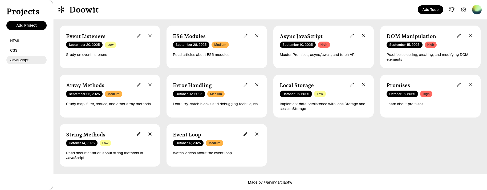

<h1 align="center">
  Doowit
  <h4 align="center">A modular to-do list web application built with JavaScript</h4>
</h1>

## 🚀 Live Site

The live site can be viewed [here](https://to-do-list-arvingarciabtw.vercel.app/).

## 📝 Project Description

The [project specification](https://www.theodinproject.com/lessons/node-path-javascript-todo-list) goes over the general instructions on doing the to-do list project. The projects and todos are objects, wherein the todo-items have the following properties: `title`, `description`, `dueDate`, and `priority`. In formatting the date, the [`date-fns`](https://github.com/date-fns/date-fns) library was used. Furthermore, the project implements [`localStorage`](https://developer.mozilla.org/en-US/docs/Web/API/Web_Storage_API/Using_the_Web_Storage_API).

## 💡 Learnings

This project was surprisingly hefty!

This [lesson](https://www.theodinproject.com/lessons/node-path-javascript-revisiting-webpack) goes over a better way of setting up Webpack. Splitting the configuration file with `webpack-merge` was very useful, and I learned the difference between development and production.

Since, there were a lot of moving parts for this one, the use of ES6 modules were super helpful in putting certain code in their own respectful files. Though, I'm sure there's a lot of improvements that can be done with how I structured my code, directories, and even with how I named some of my variables and functions.

The project went smoothly at the beginning, until I eventually encountered this bug where if I click the project `n` amount of times, and try adding a todo, the todo gets appended `n` amount of times. This happens because everytime I clicked the project, it would add a _new_ event listener to the add task button. So if I click the project five times, then five event listeners get added to the button. And so when I click the button, all those event listeners get fired!

For some reason, I initially thought that the previous event listener would just get overwritten if I clicked the project again. I spent a considerable amount of time on this problem, but eventually I figured it out by simply having the event listeners outside of the exported function. This realization made implementing the delete and edit functionalities quite easy.

As for the `localStorage` implementation, this one was also quite a head scratcher. Looking at basic examples online, it seemed simple enough. But not when the item you are trying to store is an array of objects that have methods. Eventually, I figured out that you have to first invoke `JSON.stringify()` on the projects array. Then, when you want to get that item, you have to parse it by invoking `JSON.parse()` on the item, then loop over the array and essentially recreate the `Project` instances. It was a bit confusing, but I got there after a while!

Despite to-do list projects being quite common, this was surprisingly hard and had many moving parts (or maybe it seemed like it because a ton of the code were in their own modules). Had a lot of fun with it and learned a lot!
