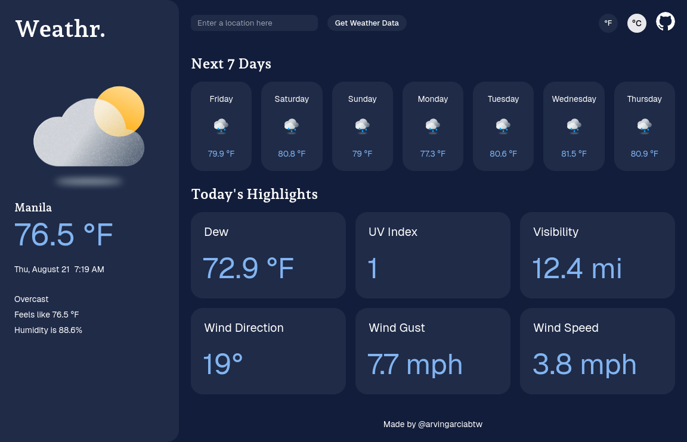

<h1 align="center">
  Weathr
  <h4 align="center">A weather application built with HTML, CSS, and JavaScript</h4>
</h1>

## 🚀 Live Site

The live site can be viewed [here](https://weather-app-arvingarciabtw.vercel.app/).

## 📝 Project Description

The [project specification](https://www.theodinproject.com/lessons/node-path-javascript-weather-app) describes the general instructions in doing the project. Primarily, this project is an opportunity to practice `Promises`, async/await, and getting/manipulating data retrieved from an API.

## 💡 Learnings

This project was fun and relatively straightforward. What I learned that stuck with me the most was that if you export an asynchronous function, and invoke that function in another file, you would still need to use the `await` keyword when you invoke it. Initially, this made me confused, but then I realized this made sense because an asynchronous function will ALWAYS return a `Promise`. As such, you would need to use `await` since the invocation of that function returns a `Promise`!

For this project, I did go a bit outside of the instructions and used the `dotenv` npm package so I can put my API key inside a `.env` variable. This `.env` is included in the `.gitignore` file, which means my actual API key will not be visible in my GitHub repo, so now my API key is only private to me! I deployed the site with Vercel, so I also had to configure the environment variables there for the site to work in production. I'm sure there are better ways of keeping the API key private, but since I'm early on in the curriculum, I just went with this for now.

All in all, I learned a lot from this very fun project!
