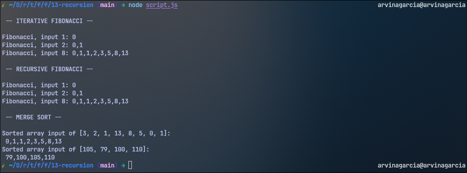

<h1 align="center">
  Recursion
  <h4 align="center">Fibonacci and merge sort using recursion</h4>
</h1>

## 🚀 How to Run

The project can be executed via `node script.js` in the terminal.

## 📝 Project Description

The [project specification](https://www.theodinproject.com/lessons/javascript-recursion) describes the general instructions in doing the project. Primarily, this project is an opportunity to practice recursion by making a [Fibonacci](https://www.geeksforgeeks.org/maths/fibonacci-sequence/) and [merge sort](https://www.geeksforgeeks.org/dsa/merge-sort/) function.

## 💡 Learnings

This was a change of pace, going from a weather app to a console project. There's really not much to say here, other than I learned about recursion. Although, in reading up on/watching the resources provided for recursion, I'd say the last example from [Web Dev Simplified's video](https://www.youtube.com/watch?v=6oDQaB2one8) is a practical use case for recursion. I hope I get to use recursion practically in a future project!
