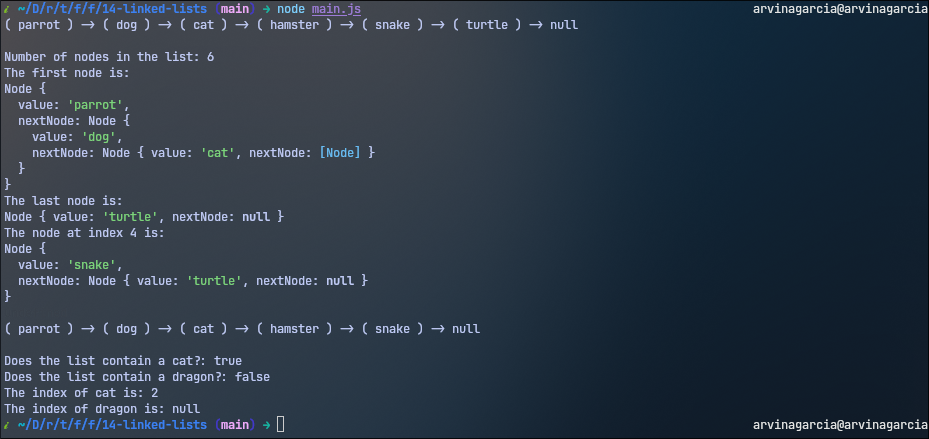

<h1 align="center">
  Linked List
  <h4 align="center">A linked list data structure built in JavaScript</h4>
</h1>

## 🚀 How to Run

The project can be executed via `node main.js` in the terminal.

## 📝 Project Description

The [project specification](https://www.theodinproject.com/lessons/javascript-linked-lists) describes the general instructions in doing the project. In this project, the main goal is to create a `LinkedList` class that has some methods, wherein this class represents a linked list data structure.

## 💡 Learnings

This one was quite challenging and really got my brain going. Do take note however that I added varying log statements to test each method in the `LinkedList` class, instead of the one mentioned in the specification. I did this since the instruction mentioned only appending nodes to the list, and not the other methods made.
