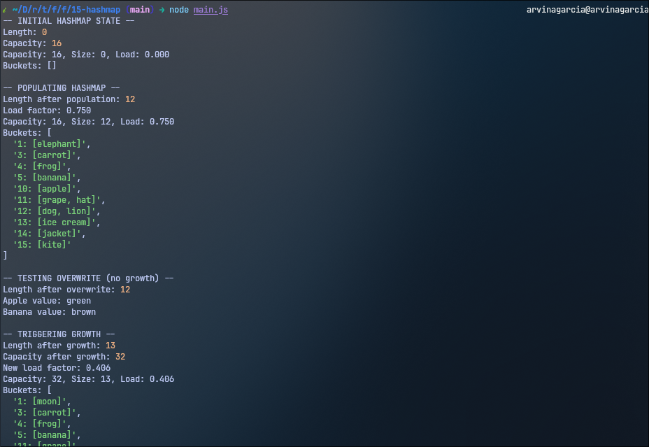

<h1 align="center">
  HashMap
  <h4 align="center">A hashmap data structure built in JavaScript</h4>
</h1>

## 🚀 How to Run

The project can be executed via `node main.js` in the terminal.

## 📝 Project Description

The [project specification](https://www.theodinproject.com/lessons/javascript-hashmap) describes the general instructions in doing the project. In this project, the main goal is to create a `HashMap` class that has some methods, wherein this class represents a linked list data structure.
