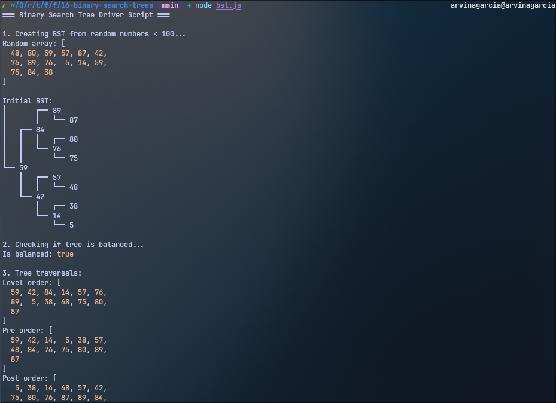

<h1 align="center">
  Binary Search Tree
  <h4 align="center">A binary search tree built in JavaScript</h4>
</h1>

## 🚀 How to Run

The project can be executed via `node bst.js` in the terminal.

## 📝 Project Description

The [project specification](https://www.theodinproject.com/lessons/javascript-binary-search-trees) describes the general instructions in doing the project. In this project, the main goal is to create a `Tree` class that has some methods, wherein this class represents a [binary search tree](https://www.geeksforgeeks.org/dsa/binary-search-tree-data-structure/).
