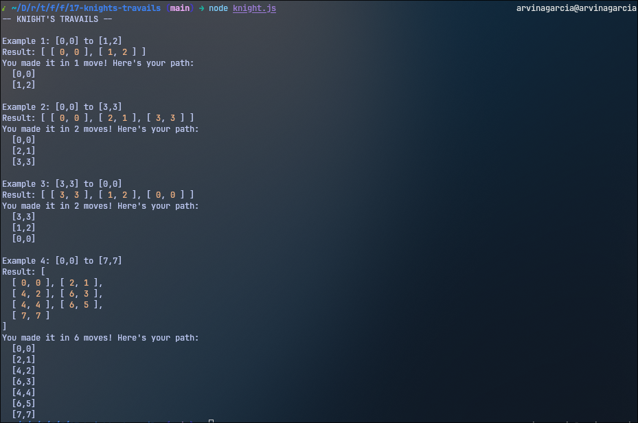

<h1 align="center">
  Knights Travails
  <h4 align="center">Identify a knight's shortest path in a chess board</h4>
</h1>

## 🚀 How to Run

The project can be executed via `node knight.js` in the terminal.

## 📝 Project Description

The [project specification](https://www.theodinproject.com/lessons/javascript-knights-travails) describes the general instructions in doing the project.
