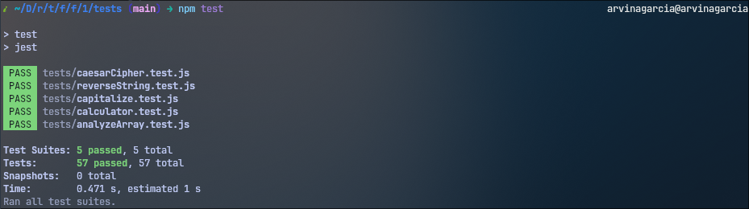

<h1 align="center">
  Testing Practice
  <h4 align="center">Practicing testing with Jest by writing a few functions</h4>
</h1>

<div align="center">


[](#)
[](#)

</div>



## 🚀 How to Run

To view test results for all files, type the command `npm test` in the terminal and execute. To view test results for a specific file, type the command `npm test [file path here]` in the terminal and execute.

## 📝 Project Description

The [project specification](https://www.theodinproject.com/lessons/node-path-javascript-testing-practice) describes the general instructions in doing the project. The primary goal of this project is to practice test driven development (TDD), in particular using [Jest](https://jestjs.io/docs/getting-started).

## 💡 Learnings

For this project, I familiarized myself with test driven development and the syntax used in Jest. It was quite straightforward, although I did struggle a bit in setting up [Babel](https://babeljs.io/docs/) with Jest since I had my `babel.config.js` in a `configs` directory instead of the root directory. Eventually, I fixed my problem by adding this inside my `package.json`:

```
"jest": {
  "transform": {
    "^.+\\.js$": [
      "babel-jest",
      {
        "configFile": "./configs/babel.config.js"
      }
    ]
  }
}
```

Other than that, the concept of testing itself was pretty intuitive. I used the `describe` function in the calculator and Caesar cipher tests to group related tests together. It was also nice having a refresher on some of the string and array methods in JavaScript by building out the functions' functionalities.
