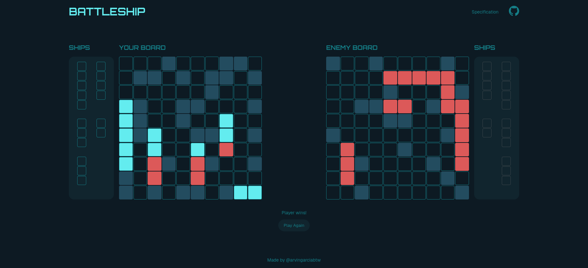

<h1 align="center">
  Battleship
  <h4 align="center">The classic battleship game built with vanilla JavaScript</h4>
</h1>

## 🚀 Live Site

The live site can be viewed [here](https://battleship-arvingarciabtw.vercel.app/).

## 📝 Project Description

The [project specification](https://www.theodinproject.com/lessons/node-path-javascript-battleship) describes the general instructions in doing the project. Since this is the last project in the JavaScript course, this is primarily an opportunity to use everything I have learned so far.

## 💡 Learnings

This project was quite challenging. The first time around that I did The Odin Project, this was where I stopped. So, it's satisfying to know that I was able to overcome this hurdle after starting over with the curriculum. I won't go into detail about each and every concept used since this project is basically the crux of _everything_ that was taught from the JavaScript course, from beginning to end. The most important thing is that you go through the project one step at a time, and begin by working on the smallest problem, then go from there.

But of course, my learning journey doesn't stop here. Onwards to the next course, I'm excited to learn about making my websites responsive!
