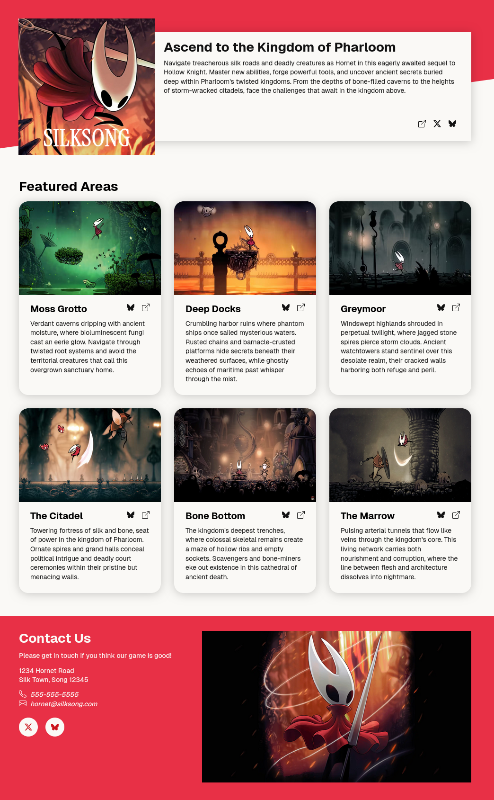

<h1 align="center">
  Homepage
  <h4 align="center">Practicing media queries by making a responsive Silksong-themed homepage.</h4>
</h1>

## 🚀 Live Site

The live site can be viewed [here](https://homepage-silksong.vercel.app/).

## 📝 Project Description

The [project specification](https://www.theodinproject.com/lessons/node-path-advanced-html-and-css-homepage) describes the general instructions for doing the project. Essentially, there is a provided layout that must be followed. Other than that, it's allowed to use different colors, fonts, and other assets.

## 💡 Learnings

Had fun making the website responsive. I decided to not follow the layout _exactly_ (e.g. no image in the footer for mobile view, text in top section image is not translated in the tablet view), but overall I was still able to practice using media queries. Funnily enough, it wasn't the responsiveness that stumped me the most, but rather making the text in the hero section wrap around the image when in [tablet view](https://cdn.statically.io/gh/TheOdinProject/curriculum/1c8b5c739efd263e8cc48703988b18d6e3afe034/advanced_html_css/responsive-design/project_personal_portfolio/imgs/portfolio%20tablet.png).

I had no idea how to do this with the current CSS knowledge I had, but thankfully this [Stack Overflow thread](https://stackoverflow.com/questions/19179424/how-to-wrap-text-around-an-image-using-html-css) came to the rescue. Basically, you can set `float: left` to the image, and it should work. It didn't work for me immediately, because apparently I needed to set `display: block` to the hero section and remove the `flex-direction: column` which was the culprit on why the text wouldn't wrap around the image.

## 📸 Image Credits

- Images from [Team Cherry](https://www.teamcherry.com.au/)
