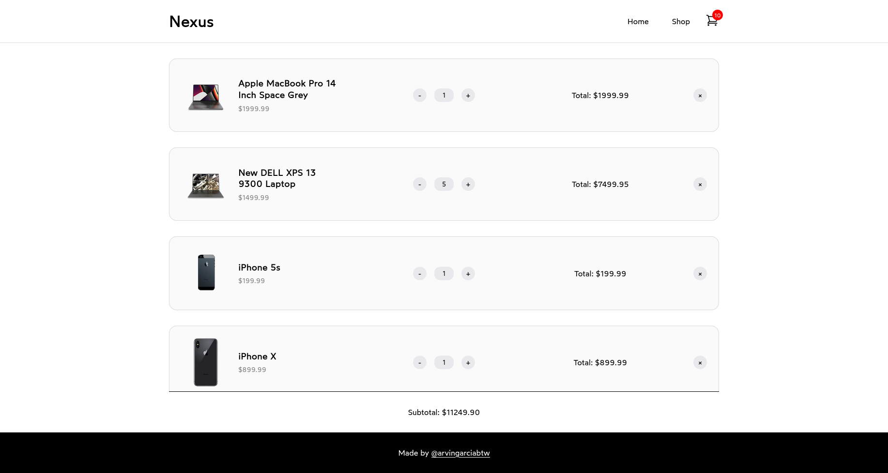

<h1 align="center">
  Nexus 
  <h4 align="center">A simple shopping cart application built with React and React Router</h4>
</h1>

## 🚀 Live Site

The live site can be viewed [here](https://nexus-tech-shop.vercel.app).

## 📝 Project Description

The [project specification](https://www.theodinproject.com/lessons/node-path-react-new-shopping-cart) describes the general instructions in doing the project. This project primarily served as practice for understanding: testing in React with [Vitest](https://vitest.dev/), implementing routes with [React Router](https://reactrouter.com/), and styling with [CSS modules](https://github.com/css-modules/css-modules).
