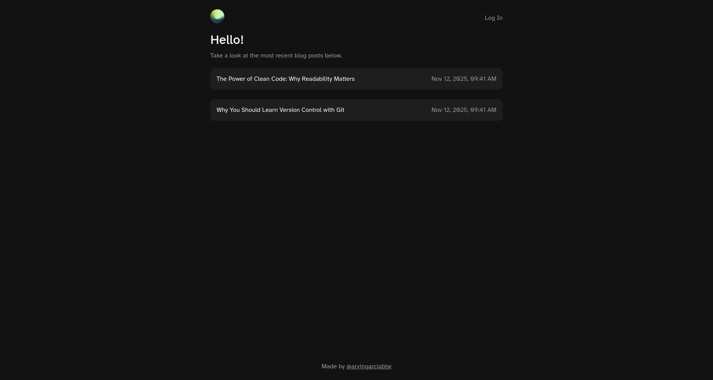
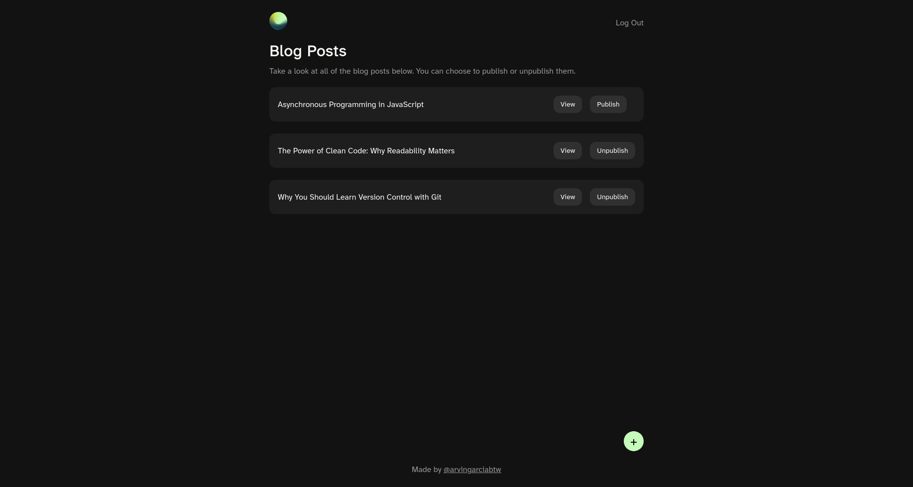
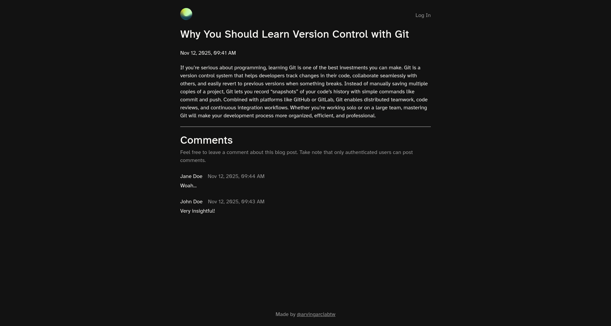

<h1 align="center">
  Blog API 
  <h4 align="center">A simple blog site with JWT authentication</h4>
</h1>

  
  
  

## 🚀 Live Site

The live site can be viewed [here](https://blog-api-frontend-user.onrender.com/). Take note that there is also a separate live site where only an admin user (me) can add posts, publish/unpublish posts, and delete comments.

## 📝 Project Description

The [project specification](https://www.theodinproject.com/lessons/node-path-nodejs-blog-api) describes the general instructions in doing the project. This project primarily served as practice for understanding the REST API, CORS, authentication with JWT, and how to connect your frontend with the backend.
