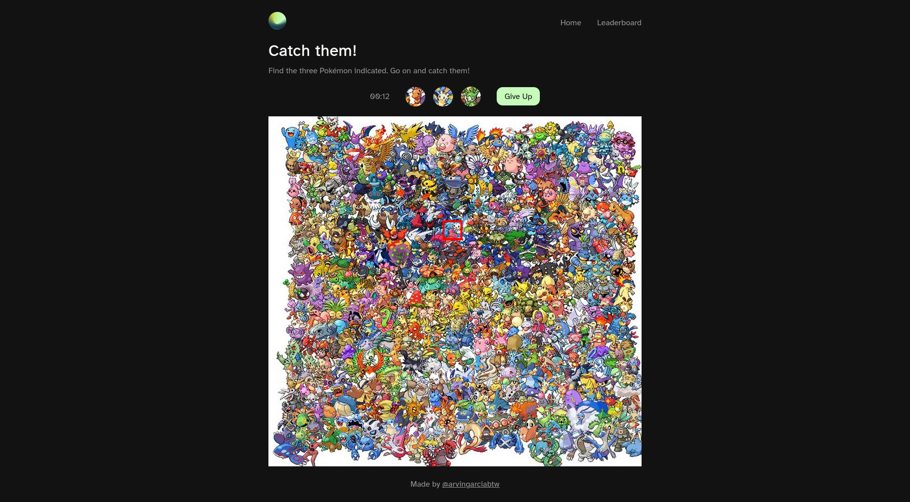
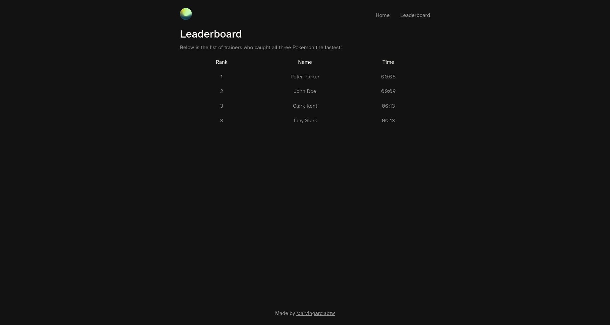

<h1 align="center">
  Where's that Pokemon? 
  <h4 align="center">A simple photo tagging application</h4>
</h1>

  
  

## 🚀 Live Site

The live site can be viewed [here](https://wheres-that-pokemon-frontend.onrender.com).

## 📝 Project Description

The [project specification](https://www.theodinproject.com/lessons/nodejs-where-s-waldo-a-photo-tagging-app) describes the general instructions in doing the project. This project primarily served as practice for understanding how to test the backend using Supertest and serving as a refresher on previous concepts.
