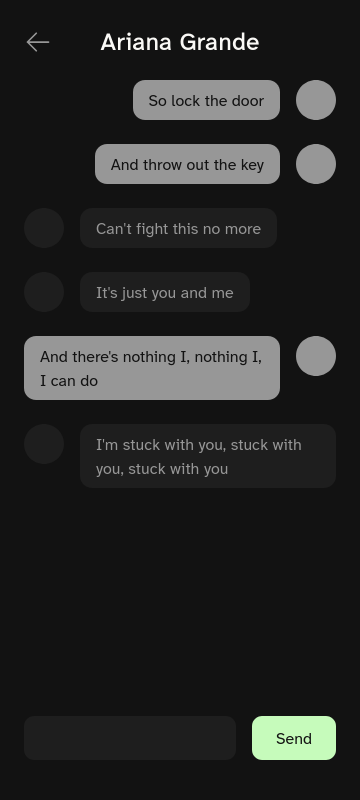
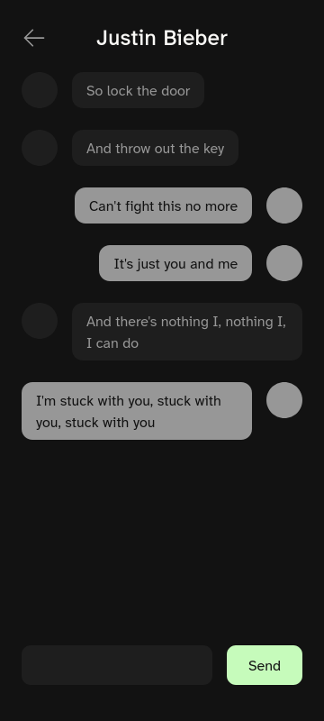

<h1 align="center">
  Messaging App 
  <h4 align="center">A simple messaging app with JWT authentication</h4>
</h1>

  
  

## 🚀 Live Site

The live site can be viewed [here](https://messaging-app-frontend-p9s1.onrender.com).

## 📝 Project Description

The [project specification](https://www.theodinproject.com/lessons/nodejs-messaging-app) describes the general instructions in doing the project. This project primarily served as practice for understanding further all of the concepts discussed in the Node.js course.
